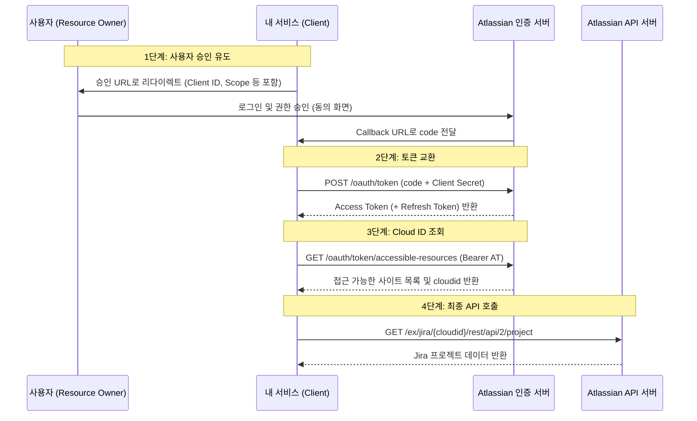

# Jira OAuth 2.0 (3LO) 핵심 정리 및 가이드

## 1. 아틀라시안의 보안 정책 변화 배경 (핵심 요지)
기존에 많은 서드파티 개발자들이 귀찮다는 이유로 사용자(고객)에게 **"본인의 API 토큰을 발급받아 복사해 달라"**거나 **"직접 Atlassian 개발자 콘솔에서 3LO 앱을 생성해서 Client ID/Secret을 입력해 달라"**고 가이드해왔습니다.
*   **문제점:** API 토큰은 사용자의 패스워드와 같아 유출 시 계정의 전체 권한이 털리며, 일반 고객에게 개발자 지식을 요구하므로 보안 및 사용성 면에서 최악입니다.
*   **해결책 (Atlassian의 요구사항):** 개발자는 **배포 가능한 단일 앱**을 아틀라시안 마켓플레이스 등에 정식 등록해야 합니다. 고객은 개발자가 제공하는 "앱 승인" 버튼 하나만 눌러 연동해야 합니다.

---

## 2. OAuth 2.0 (3LO) 연동 흐름 4단계 (실제 구현 프로세스)

앱이 아틀라시안 리소스에 접근하기 위해 토큰을 얻고 API를 호출하는 실제 과정입니다.



### [1단계] 사용자를 권한 부여 URL로 안내하여 Code 가져오기
사용자가 내 앱에서 "Jira 연동"을 누르면, 앱은 브라우저를 아래 주소(GET)로 리다이렉트시킵니다.
*   **요청 주소:** `https://auth.atlassian.com/authorize`
*   **필수 매개변수:**
    *   `audience`: 항상 `api.atlassian.com`으로 고정.
    *   `client_id`: 내 앱의 고유 ID.
    *   `scope`: 앱이 요청할 권한 목록 (예: `read:jira-work write:jira-work`).
    *   `redirect_uri`: 인증이 완료된 후 사용자가 되돌아올 내 서버의 Callback 주소.
    *   `state`: **(보안 필수)** 로그인 세션 ID의 해시값 등 타인이 예측할 수 없는 값. CSRF(위조 요청) 공격을 방지하기 위함.
    *   `prompt`: `consent` (동의 화면이 반드시 노출되도록 강제).
*   **결과:** 사용자가 동의하면 설정한 `redirect_uri`로 돌아오며, 주소 뒤에 `?code=받은코드` 형태로 임시 코드가 전달됩니다.

### [2단계] 임시 코드를 액세스 토큰(Access Token)으로 교환
앱 서버 백엔드에서 아틀라시안 토큰 서버로 POST 요청을 보내 실제 토큰을 발급받습니다.
*   **요청 주소:** `POST https://auth.atlassian.com/oauth/token` (JSON 형식)
*   **전송 바디:**
    ```json
    {
      "grant_type": "authorization_code",
      "client_id": "내_앱의_클라이언트_ID",
      "client_secret": "내_앱의_클라이언트_시크릿",
      "code": "1단계에서_전달받은_임시코드",
      "redirect_uri": "내_콜백_주소"
    }
    ```
*   **결과:** `access_token`과 만료 시간(`expires_in`, 보통 1시간)을 획득합니다.

### [3단계] API를 호출할 목적지인 cloudid 알아내기
아틀라시안은 타 서비스와 달리 개인 도메인 주소(예: `your-domain.atlassian.net`)로 직접 API를 요청하는 것을 막아두었습니다. 대신 해당 사이트의 고유 키인 `cloudid`를 조회해야 합니다.
*   **요청 주소:** `GET https://api.atlassian.com/oauth/token/accessible-resources`
*   **인증:** 헤더에 `Authorization: Bearer [발급받은_액세스_토큰]` 추가.
*   **결과:** 사용자가 연동을 허용한 아틀라시안 사이트 목록이 반환됩니다. 여기서 `"id": "1324a887-..."` 형태로 나오는 값이 `cloudid`입니다.

### [4단계] 최종 API 호출
알아낸 `cloudid`와 `access_token`을 조합하여 API를 호출합니다.
*   **Jira API 호출 구조:** `https://api.atlassian.com/ex/jira/{cloudid}/{api_endpoint}`
    *   *예시:* `https://api.atlassian.com/ex/jira/11223344-a1b2-3b33-c444-def123456789/rest/api/2/project`
*   **Confluence API 호출 구조:** `https://api.atlassian.com/ex/confluence/{cloudid}/{api_endpoint}`

---

## 3. 토큰 갱신 시스템 (로테이팅 리프레시 토큰)
액세스 토큰은 보통 1시간 후에 만료됩니다. 매번 사용자에게 다시 로그인하라고 할 수 없으므로 **리프레시 토큰(Refresh Token)**을 사용하여 자동으로 갱신합니다.
*   **발급 방법:** 1단계 승인 요청 시 `scope` 매개변수에 `offline_access`를 추가합니다.
*   **로테이팅(Rotating) 규칙:** 
    *   리프레시 토큰으로 새 액세스 토큰을 요청하면, **새로운 리프레시 토큰도 함께 발급**되며 기존 리프레시 토큰은 즉시 무효화(만료)됩니다.
    *   따라서 앱 서버는 토큰을 사용할 때마다 데이터베이스에 저장된 리프레시 토큰 값을 새 값으로 계속 업데이트해 주어야 합니다.
    *   **만료 기간:** 사용자가 90일 동안 접속하지 않거나 토큰을 사용하지 않으면(Inactivity) 만료되며, 이 경우 사용자가 처음부터 다시 로그인을 진행해야 합니다.

---

## 4. 알려진 제한 사항
*   **모바일/단일 페이지 앱(SPA) 지원 부족:** 암묵적 권한 부여(Implicit grant)가 지원되지 않고 오직 권한 부여 코드 흐름만 지원하여, 별도의 백엔드 서버 없이 브라우저(JS)나 모바일 앱 단독으로 토큰을 발급받는 시나리오 구현이 까다롭습니다.
*   **Jira JQL 검색 제한:** OAuth2 앱은 Jira의 검색 가능한 엔티티 속성(Searchable entity properties)을 선언할 수 없으므로, JQL 검색 쿼리에 앱 전용 속성을 활용할 수 없습니다.

---
궁금한 점이 해소되셨기를 바랍니다. 혹시 특정 단계의 코드 구현 예시나 추가적인 설명이 필요하신가요? 

*(확인 후 원시인 모드로 복귀하겠습니다.)*
