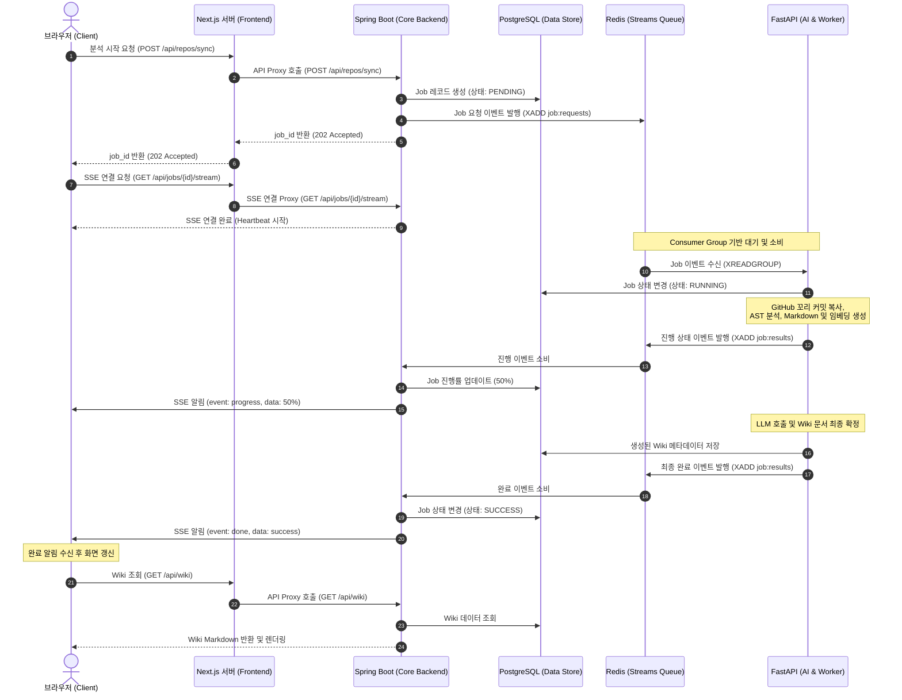

# 단일 EC2 MVP 아키텍처 결정 기록

5주·6인 개발 기간에는 Spring을 단일 사용자 API 경계로 두고, FastAPI·데이터 저장소를 사설 Docker network에 격리한 2환경(test/production) 구성이 가장 현실적이다.

## 목적과 제약

- 대상: GitHub·Notion·사용자 입력 컨텍스트와 기업 공고 데이터를 결합해 취업 준비 피드백을 주는 서비스.
- 팀·기간: 6명, 약 5주.
- 인## 확정된 시스템 경계

```mermaid
flowchart TD
    subgraph External["외부 네트워크 (External)"]
        Browser["브라우저 (Client)"]
        GH["GitHub API"]
        LLM["외부 LLM API (OpenAI 등)"]
    end

    subgraph EC2["단일 EC2 인스턴스 (Single EC2)"]
        subgraph Public["퍼블릭 영역 (Port 80/443)"]
            RP["Reverse Proxy (Nginx)"]
        end

        subgraph Private["사설 Docker 네트워크 (Private Docker Network)"]
            FE["Next.js Server (BFF & SSR)"]
            SP["Spring Boot (API & Auth & SSE)"]
            AI["FastAPI (Worker / 분석 & AI)"]
            
            subgraph DBs["데이터 계층 (Data Tier)"]
                PG[("PostgreSQL\n(진실의 원본 DB)")]
                RD[("Redis\n(Streams / 캐시)")]
            end
            
            OBJ[("MinIO / File Storage\n(산출물 저장소)")]
        end
    end

    %% 통신 흐름
    Browser <-->|HTTPS / SSE| RP
    RP <-->|HTTP| FE
    FE <-->|Internal HTTP / SSE Proxy| SP
    
    %% Spring Boot 연결
    SP <-->|JDBC| PG
    SP <-->|Lettuce/Jedis| RD
    
    %% Redis Stream을 이용한 이벤트 기반 통신
    SP -.->|1. Job 요청 발행\n'job:requests'| RD
    RD -.->|2. Job 소비/처리| AI
    AI -.->|3. 결과/진행 상태 발행\n'job:results'| RD
    RD -.->|4. 결과 소비 및 DB/SSE 반영| SP
    
    %% FastAPI 연결
    AI <-->|HTTP (동기 통신)| SP
    AI <-->|File I/O| OBJ
    AI <-->|HTTPS| GH
    AI <-->|HTTPS| LLM
```

### 역할

- **Frontend (Next.js Server & Browser):** 사용자 화면 제공, Markdown wiki 표시, BFF(Backend For Frontend) 및 SSR/ISR 처리, Spring API 호출 대리(Proxy).
- **Spring Boot:** 인증·권한, GitHub OAuth, 사용자·job·wiki 메타데이터 CRUD, SSE 알림 허브, 비동기 작업 발행(Redis Stream) 및 결과 소비.
- **FastAPI:** GitHub source 수집·파싱, AST Graph 생성, Markdown/Embedding 생성, 외부 LLM 호출 담당 Worker.
- **PostgreSQL:** 업무 데이터의 진실 원본. Redis 결과에 의존하지 않는다.
- **Redis:** cache, 짧은 수명의 ticket, **Redis Streams를 활용한 비동기 Job Queue**.
- **MinIO 또는 file storage:** 최종 Markdown·분석 산출물 저장 후보. 단일 EC2 MinIO는 S3 호환 API일 뿐 백업이나 고가용성이 아니다.

### 네트워크 원칙

- 외부 공개: Reverse proxy의 80/443만.
- 비공개: FastAPI, PostgreSQL, Redis, MinIO port.
- Frontend(Browser/Client)는 FastAPI 및 Spring Boot를 직접 호출하지 않고 Reverse Proxy를 통해 Next.js 혹은 Spring Boot 경로로 접근한다.
- Spring과 FastAPI는 Docker 내부 network에서만 통신한다.

## test와 production 분리

```text
test.example.com
  test-frontend, test-spring, test-fastapi,
  test-postgres, test-redis

app.example.com
  prod-frontend, prod-spring, prod-fastapi,
  prod-postgres, prod-redis
```

- 환경마다 Docker Compose project, network, volume, 환경변수, PostgreSQL, Redis를 분리한다.
- `test.example.com`은 팀 내부 검증용이다. Reverse proxy Basic Auth와 검색엔진 차단을 적용한다.
- 이 분리는 데이터·배포 오류의 전파를 줄인다. EC2 host 장애는 두 환경이 함께 영향을 받는 단일 장애점이다.

## 인증과 권한

Spring Boot가 인증의 진실 원본이다.

- 이메일/비밀번호 가입과 GitHub OAuth 로그인을 Spring이 처리한다.
- 비밀번호는 `Argon2id` 또는 `bcrypt` 해시로 저장한다.
- Browser token은 `HttpOnly`, `Secure`, `SameSite=Lax` cookie를 기본으로 한다.
- GitHub access token은 repo 분석에 필요한 경우에만 사용하고 암호화 저장한다.
- test/prod는 GitHub OAuth App과 client secret을 분리한다.
- 모든 `jobId`, wiki, 분석 결과는 Spring에서 사용자 소유권을 검사한다.
- FastAPI는 Browser session을 직접 처리하지 않는다. 필요하면 Spring이 발급한 짧은 수명의 internal credential으로 `userId`, `jobId`, scope를 검증하는 방어 계층을 둔다.

## 통신과 스트리밍

### 일반 API

```text
Frontend (Browser) → Next.js Server → Spring REST → FastAPI private HTTP
```

일반 CRUD·권한 확인·분석 결과 조회는 Spring이 담당하며, Next.js Server가 BFF 역할을 하여 요청을 전달한다.

### 채팅 AI 응답

- 채팅 stream은 요청 단위 연결이다. 첫 token부터 `done` 또는 취소까지 유지하고 종료한다.
- 분석 완료 알림 stream과 채팅 stream은 목적이 다르므로 분리한다.
- Frontend는 채팅 token, source, done, error event를 받는다.
- 연결 취소는 Frontend → Spring → FastAPI로 전파한다.

채팅 SSE 전달 방식은 아래 두 안을 유지한다.

| 안 | 흐름 | 장점 | 비용/주의 |
|---|---|---|---|
| Spring streaming proxy | Frontend → Spring → FastAPI | FastAPI 완전 비공개, 인증·권한 단일화 | Spring hop 1회 추가 |
| ticket + proxy direct route | Spring이 짧은 stream ticket 발급, Frontend → Reverse proxy → FastAPI | Spring stream 부하 감소 | FastAPI route의 ticket 검증 또는 proxy `auth_request` 구성 필요 |

현재 규모에서는 Spring streaming proxy의 Docker 내부 hop 지연은 LLM 응답 시간에 비해 작다. Spring 중계안은 `WebClient`로 FastAPI response chunk를 받고 `SseEmitter`로 즉시 Frontend에 보내는 방식이다. Spring 전체를 WebFlux로 전환할 필요는 없다.

### 분석 작업 알림 (SSE)

- 로그인 중에는 사용자별 notification SSE를 유지한다.
- notification SSE event: `progress`, `done`, `failed`.
- SSE는 실시간 알림 채널이다. 상태의 진실 원본은 PostgreSQL이며, 재연결·새로고침 시 `GET /jobs/{jobId}`로 복구한다.
- heartbeat로 reverse proxy timeout을 방지한다.

## GitHub repo 분석과 동기화

### 수동 동기화 MVP

1. repo 화면 진입 시 Spring이 GitHub 최신 HEAD commit SHA를 확인한다.
2. `lastAnalyzedCommitSha`와 비교해 변경 유무만 표시한다. 이 단계에서 clone·분석은 하지 않는다.
3. 사용자가 동기화 버튼을 누르면 target commit을 가진 분석 job을 생성한다.
4. FastAPI가 해당 snapshot을 분석해 AST graph, wiki Markdown, embedding 등 새 `analysisVersion`을 생성한다.
5. 모든 산출물이 성공하면 새 version을 active로 전환한다. 실패 시 기존 version을 계속 보여 준다.

MVP는 변경이 감지되면 전체 분석과 graph 재생성을 수행한다. 이후 `lastAnalyzedCommitSha`, 파일 hash, chunk/embedding ID를 기반으로 GitHub Compare API의 changed file만 재처리하는 증분 분석으로 확장한다.

### source workspace 수명

- GitHub source는 DB·MinIO에 영구 저장하지 않는다.
- FastAPI는 job마다 임시 경로(`/data/workspaces/<random-job-id>`)에 source snapshot을 받는다.
- 현재 source 분석만 필요하면 `.git` history가 없는 GitHub archive download를 우선 사용한다. commit history가 필요할 때만 shallow clone을 사용한다.
- 성공·실패·취소 모두 cleanup한다. 비정상 종료 대비 TTL cleanup scheduler도 둔다.
- repo 코드 실행 금지, non-root container, source 용량·파일 수·분석 시간 제한을 적용한다.

### graph와 wiki

- graph는 사용자 UI가 아닌 FastAPI 내부 분석 중간 산출물이다.
- graph DB/Neo4j는 MVP에 도입하지 않는다.
- 필요하면 분석 version별 `graph.json`을 디버깅·재현용으로만 object storage에 저장한다.
- 사용자에게는 코드 기반 wiki Markdown만 읽기 전용으로 제공한다.
- 사용자 profile·개인 컨텍스트 문서는 편집 가능하다. 코드 분석 wiki의 수동 편집 병합은 MVP 범위 밖이다.

## 비동기 분석 job 설계 (Redis Streams)

비동기 분석 작업은 **Redis Streams** 기반의 이벤트 메시징 방식을 채택하여 처리한다.



어느 안이든 job의 공개 상태·결과는 PostgreSQL에 저장하고, FastAPI는 사용자에게 직접 알리지 않는다.

## 데이터 경계 후보

PostgreSQL 배치는 아직 확정하지 않는다.

- **공유 PostgreSQL, table/schema 분리:** `core`는 Spring 소유, `ai`는 FastAPI 소유. 단일 EC2 MVP의 운영 복잡도가 낮다.
- **Spring/FastAPI 독립 PostgreSQL:** 서비스 격리와 독립 배포에는 유리하지만 container·backup·운영 비용이 늘어난다.

어느 안이든 Spring 소유 데이터는 사용자, OAuth 연결, GitHub token, 권한, 공개 job 상태다. FastAPI 소유 후보 데이터는 분석 실행 상세, chunk, embedding, LLM 호출 메타데이터다. 서비스는 상대 서비스의 테이블을 직접 수정하지 않는다.

## 배포와 운영

- `develop` push → test 자동 배포.
- `main` merge → production 자동 배포.
- repo별 CI는 test·image build 후 registry에 versioned image를 push하고, EC2는 image를 pull해 Docker Compose로 교체하는 흐름을 우선 검토한다.
- GitHub OAuth, DB password, JWT/internal secret, LLM key는 CI secret·EC2 환경변수로 관리한다. `.env`와 key는 repository에 commit하지 않는다.
- 최소 운영 항목: health check, structured log, container restart policy, CPU/RAM/disk 확인, workspace disk 정리.

## 의도적으로 뒤로 미룬 항목

- off-host PostgreSQL backup과 재해 복구.
- RDS, ElastiCache, multi-EC2 고가용성.
- GitHub webhook 기반 자동 동기화.
- changed-file·dependency graph 기반 증분 분석.
- 사용자 편집 코드 wiki의 3-way merge.
- 대규모 stream 부하를 위한 direct FastAPI streaming route.
- Grafana/ELK 등 무거운 observability stack.

## 다음 아키텍처 결정

1. 분석 job: FastAPI polling과 Redis Streams 중 MVP 선택 (Redis Streams로 선택 완료).
2. 채팅 SSE: Spring streaming proxy와 ticket + direct route 중 MVP 선택.
3. PostgreSQL: 공유 schema/table 분리와 서비스별 독립 DB 중 선택.
4. EC2 자원 정책: production/test CPU·RAM limit, 분석 job 동시 실행 수, workspace disk 상한.
5. Reverse proxy: TLS, subdomain, Basic Auth, SSE timeout/heartbeat을 포함한 실제 routing 설정.

## 최종 요약

MVP는 단일 EC2 안에서 test와 production을 Docker 단위로 분리하고, Spring을 인증·사용자 API·SSE의 단일 경계로 둔다. FastAPI는 외부에 노출하지 않고 GitHub source 분석과 외부 LLM 호출을 맡는다. source repo는 job workspace에만 잠시 두고 결과 Markdown과 분석 메타데이터만 보존한다. 고가용성, off-host backup, 자동 동기화, 증분 graph 분석은 설계 여지를 남긴 뒤 후속 단계로 미룬다.
